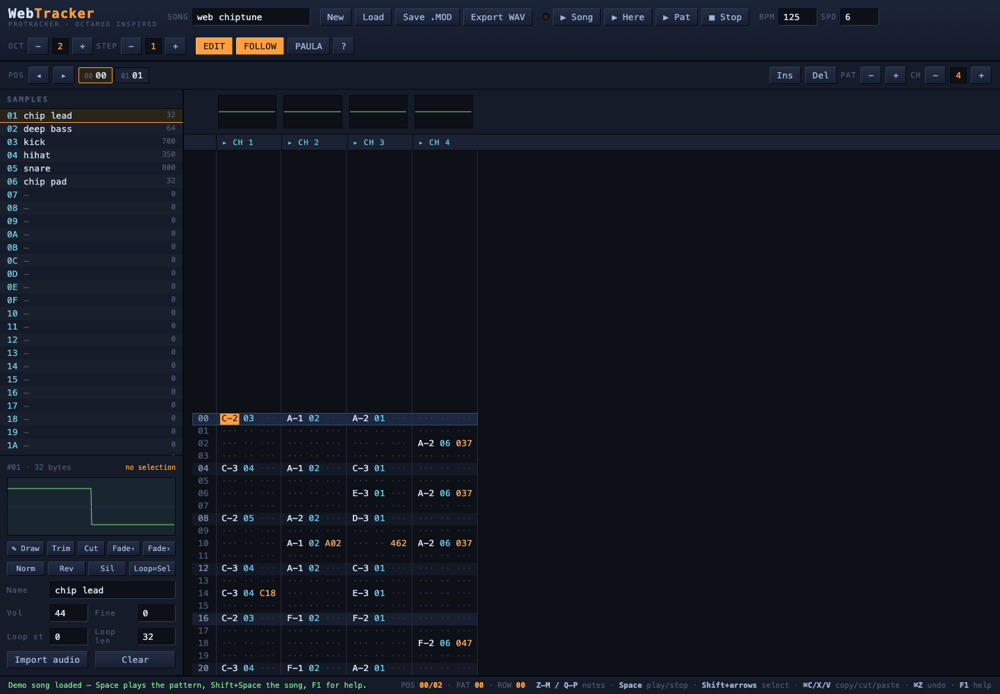

# WebTracker

WebTracker is a browser-based Amiga music tracker inspired by **ProTracker** and
**OctaMED**. It runs as a static web app and can load, edit, play, and save
classic tracker modules directly in the browser.

Live app: <https://ramonlinares.github.io/MusicTracker/>



## Quick Start

The hosted version runs on GitHub Pages:

<https://ramonlinares.github.io/MusicTracker/>

For local development, use any static file server. AudioWorklet modules cannot
be loaded from `file://`, so opening `index.html` directly is not enough.

```sh
python3 -m http.server 8642
```

Then open <http://localhost:8642>.

The npm scripts are convenience wrappers only; there are no runtime package
dependencies.

```sh
npm run serve
npm test
```

A demo song is generated on startup. Press **Space** to loop the current
pattern, **Shift+Space** to play the song, and **F1** for the keyboard reference.

## Format Support

- Loads and saves ProTracker `.MOD` files.
- Loads `M.K.`, `M!K!`, `FLT4`, `xCHN`, and 15-sample Ultimate SoundTracker
  modules.
- Loads OctaMED MMD0/MMD1 modules and converts them into the internal song
  model.
- Loads FastTracker II `.XM` modules: notes are remapped into the MOD octave
  range (honoring each sample's relative note), the volume column is folded
  into free effect slots, 16-bit and ping-pong-looped samples are converted,
  and patterns longer than 64 rows are split into chained patterns. Envelopes,
  panning, global volume, and channels past 8 are dropped.
- Saves as ProTracker-compatible MOD data. OctaMED synth concepts are playable
  after import but cannot be represented in saved MOD files.
- Saves and loads native WebTracker projects (`.wtp`, JSON): a full-fidelity
  container that keeps everything MOD cannot hold — MED synth instruments,
  any channel count, initial tempo, and the Paula-mode setting.

## Features

- **Authentic playback engine** — a ProTracker replayer running in an
  AudioWorklet: Paula-style period-based resampling (PAL clock), tick/row
  timing from BPM (`sampleRate · 2.5 / BPM`), Amiga L-R-R-L stereo panning.
- **Full effect set** — arpeggio (0xy), portamento (1/2/3), vibrato (4),
  porta+volslide (5), vib+volslide (6), tremolo (7), sample offset (9),
  volume slide (A), position jump (B), set volume (C), pattern break (D),
  E-commands (LED filter E0, fine porta E1/E2, glissando control E3,
  vibrato/tremolo waveform select E4/E7 — sine/ramp/square/random,
  set finetune E5, pattern loop E6, retrigger E9, fine volume EA/EB,
  note cut EC, note delay ED, pattern delay EE), and speed/tempo (F).
- **Paula mode** — a header toggle switches from clean linear interpolation to
  authentic Amiga output: nearest-neighbour 8-bit resampling, the A500's fixed
  ~4.9 kHz RC low-pass, and the ~3.3 kHz "LED" filter controlled by E0x.
  WAV export honors the toggle.
- **Live record mode** — with EDIT on while playing (button turns to a red
  REC), note keys sound immediately and are written into the playing pattern,
  quantized to the nearest row; one undo step removes the whole take.
- **MIDI input** — toggle MIDI in the header to play from a hardware keyboard
  (WebMIDI): notes jam on the cursor channel, chords spread across channels,
  note-off stops looped/synth voices, and in record mode velocity lands as a
  Cxx volume command when the effect slot is free.
- **Pattern editor** — canvas grid with ProTracker-style two-row piano keymap,
  hex entry for sample/effect columns, adjustable edit step, follow mode,
  live jam on keys, **block selection** (Shift+arrows or mouse drag),
  **copy/cut/paste**, **transpose** (semitone/octave), track insert/delete,
  per-channel **mute and solo**.
- **Undo/redo** — up to 250 steps covering pattern edits, block operations,
  order-list changes and sample edits (Ctrl/⌘+Z, Shift+Ctrl/⌘+Z).
- **31 samples** — 8-bit signed with loop points, volume, finetune; import any
  audio file (WAV/MP3/…) resampled to the Amiga C-2 rate (8287 Hz).
- **Waveform editor** — drag to select a region; trim, cut, fade in/out,
  normalize, reverse, silence, set loop from selection; freehand **draw mode**
  (drawing on an empty slot creates a looping chip waveform); wave clipboard
  **Copy / Mix-paste**, one-octave resampling (**+8ve/−8ve**), **Boost**, and
  a low-pass **Filter** in the classic ProTracker style.
- **Microphone sampling** — the ● Rec button records from the mic (up to
  15 s) and converts straight to 8-bit at the Amiga C-2 rate.
- **Chip Synthesizer** — the Synth button designs synth instruments the
  SID/Game Boy way: waveform + duty cycle, PWM sweep, attack/decay/sustain,
  chord arpeggios, pitch slides (kicks, zaps), and vibrato. Everything
  compiles to OctaMED-style synth programs played by the built-in engine,
  updates live while the song plays, and saves into `.wtp` projects.
- **Drum machine view** — the DRUMS tab shows the pattern as an x0x step
  grid: one lane per channel with its own sample and note, click/drag to
  paint hits, Shift+click to cycle velocity, and per-lane **Euclidean
  rhythm fills** (hits + rotation, Elektron style). It is just another lens
  on the same pattern data, so undo, playback, and all file formats keep
  working.
- **Swing** — the SWG control (50–75%) adds MPC-style shuffle at the engine
  level: even rows stretch, odd rows shrink, pairs keep their combined
  length. Saved in `.wtp` projects and applied to WAV exports.
- **Song editor** — order list (up to 128 positions), insert/delete positions,
  per-position pattern assignment, oscilloscopes per channel, **4–8 channels**
  (CH −/+ in the order bar; 4-channel songs save as `M.K.`, others as
  `6CHN`/`8CHN` etc., which OpenMPT/MilkyTracker and most players read).
- **File I/O** — byte-exact round trip of pattern data with real ProTracker
  modules; saved files open in ProTracker, OctaMED, OpenMPT, MilkyTracker, etc.
  OctaMED MMD0/MMD1 files are converted on load (blocks longer than 64 lines
  are split into chained patterns, MED commands are mapped to their ProTracker
  equivalents, play/sample transpose is baked in; MMD2/3 are not supported).
- **MED synthsounds** — synthetic and hybrid instruments play through a
  tick-rate interpreter of their volume/waveform programs: volume envelopes,
  waveform cycling, SPD/WAI/JMP/HLT/CHU/CHD, ARP chord arpeggios and the
  JVS/JWS cross-jumps (synth vibrato commands are parsed but skipped). Synth
  instruments show as `syn`/`hyb` in the sample list and can be jammed and
  sequenced like samples — but they can't be saved to .MOD, which has no
  synth concept.
- **WAV export** — renders the whole song offline (honoring tempo changes,
  jumps, breaks and loops when computing the length) to 44.1 kHz 16-bit
  stereo. Muted channels stay muted, so it can also render stems.
- **Pattern sharing** — export the current pattern as a full 64-row PNG
  snapshot or as a single-pattern WAV clip (EXPORT · Clip / PNG).
- **Music assistant** — the ASSIST panel puts a knowledgeable tracker
  friend next to the grid: key/scale selection with **auto-detection**,
  a **scale lock** that snaps keyboard and MIDI entry, out-of-scale note
  highlighting, a diatonic chord palette with three insert modes,
  in-scale **harmonization**, seeded **bassline/melody generators**
  (progressions, contours, density, reroll), **humanize**, the classic
  echo and octave-double tricks, and a **song analyzer** that reports the
  key, per-bar chords, channel roles, echo relationships, and concrete
  improvement tips. Everything is undoable and works offline.
- **Themes** — six looks selectable from the header and remembered locally:
  Amiga retro (default), skeuomorphic Workbench gray, modern dark Studio,
  Brutalist, green-phosphor Terminal, and Vaporwave. Every canvas (pattern,
  scopes, waveform, drum grid) and the PNG export follow the theme.
- **Install/offline support** — includes a web app manifest and service worker
  so the app shell can be installed and opened offline after a first visit.
- **Autosave** — current work is saved to browser storage and restored when the
  app is reopened.
- **Drag-and-drop loading** — drop a `.mod`, `.med`, or `.mmd` file onto the
  page to load it.

## Keys

Press **F1** in the app for the full reference.

| Key | Action |
| --- | --- |
| `Z`–`M`, `Q`–`P` | enter notes (two octaves, ProTracker layout) |
| `Space` / `Shift+Space` | play pattern / play song · stop |
| `[` / `]` | octave down / up |
| `Tab`, arrows, PgUp/PgDn, Home/End | navigate |
| `Shift`+arrows or mouse drag | select block |
| `Ctrl/⌘` + `C` `X` `V` `A` `Z` | copy · cut · paste · select · undo |
| `Shift+Alt+↑/↓` (`PgUp/PgDn`) | transpose ±1 semitone (±1 octave) |
| `0-9 A-F` | hex entry in sample/effect columns |
| `Delete` / `Insert` / `Backspace` | clear · push track down · pull up |
| click / shift+click channel header | mute / solo |

## Project Layout

- `index.html`, `css/style.css` — UI shell
- `js/mod.js` — ProTracker MOD parser/writer, note tables, demo song
- `js/med.js` — OctaMED MMD0/MMD1 loader
- `js/xm.js` — FastTracker II XM loader
- `js/worklet.js` — replayer + mixer (audio thread)
- `js/player.js` — main-thread AudioWorklet wrapper
- `js/patternview.js` — canvas pattern editor
- `js/app.js` — UI glue, keyboard, selection/undo, sample & order editors, file I/O
- `js/pwa.js`, `service-worker.js`, `manifest.webmanifest` — install/offline shell
- `tests/mod-roundtrip.test.js` — synthetic MOD parser/writer smoke tests
- `assets/` — screenshots, icons and social preview images

## Development Notes

- The app has no build step and no runtime dependencies.
- Keep generated audio/module exports out of the repository. `.mod` files are
  ignored intentionally.
- Keep local editor or assistant configuration out of the repository. The
  `.claude/` folder is ignored intentionally.
- Test changes through a local static server so AudioWorklet loading matches the
  hosted environment.
- Run `npm test` before publishing parser/writer changes.

## Deployment

This repository is published with GitHub Pages from the `main` branch at the
repository root. The `.nojekyll` file keeps GitHub Pages from applying Jekyll
processing to the static site.

## Security

WebTracker processes user-selected module and audio files locally in the
browser. Do not upload private or copyrighted modules to public issues unless
you have the right to share them. See [SECURITY.md](SECURITY.md) for reporting
guidance.

## License

WebTracker is released under the [MIT License](LICENSE).
